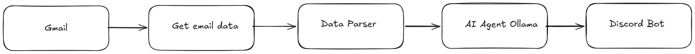
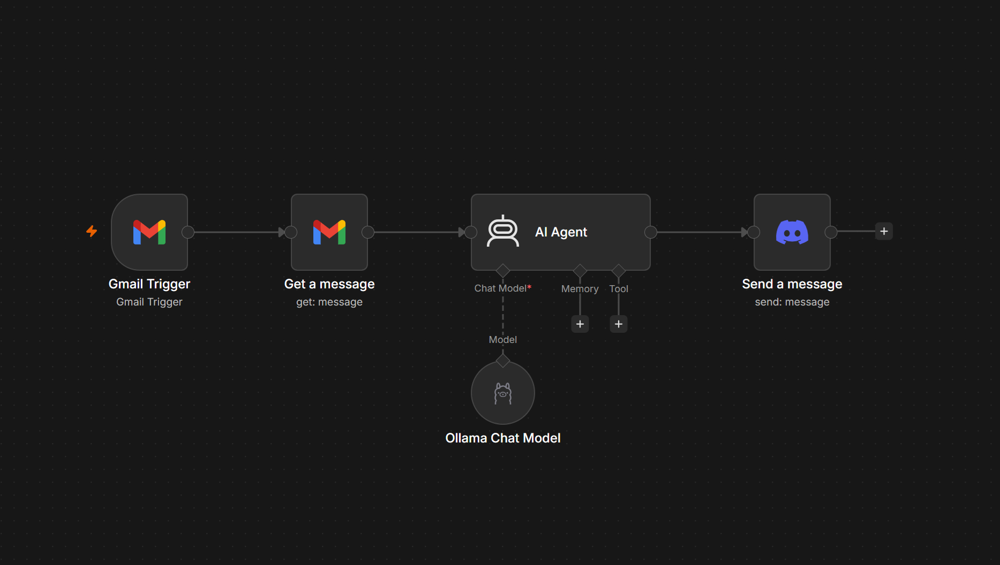
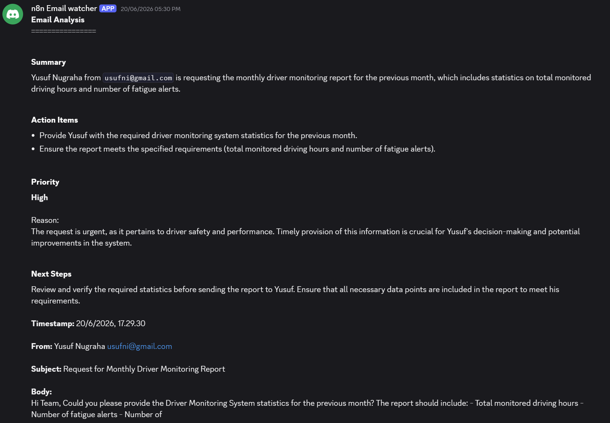

# Gmail → Discord Notification Automation

## Overview

An automation workflow built with n8n that monitors incoming
emails and sends relevant email notifications to a Discord channel.

## Problem

Previously, important emails had to be checked manually.
This created a risk of missing time-sensitive notifications.

## Solution

I built an event-driven workflow using:

- n8n
- Gmail API
- Google OAuth 2.0
- Discord Bot API
- Ollama
- LLM

The workflow automatically processes incoming emails,
extracts the relevant information, and sends a formatted
notification to Discord.

Before:
Manual checking
~30 emails/day
~1–2 minutes/email

After:
Automated processing
24/7 monitoring
Near real-time notification

## Architecture

## Implementation

### 1. Gmail Trigger

The workflow listens for new incoming emails.

### 2. Email Processing

The workflow extracts:

- Sender
- Subject
- Timestamp
- Email body

### 3. AI Processing

An LLM analyzes the email and generates a concise summary.

### 4. Discord Notification

The processed information is sent to a Discord channel.

## Result

The automation removes the need to manually monitor
incoming emails and provides notifications directly
inside Discord.

## Technologies

- n8n
- Gmail API
- Google OAuth 2.0
- Discord API
- Ollama
- LLM
- JavaScript

## Lessons Learned

- OAuth 2.0 integration
- API authentication
- Webhook/event-driven architecture
- Data transformation
- AI integration
- Error handling

## Future Improvements

- Add retry mechanism
- Add notification priority
- Store processed emails
- Add monitoring and logging

